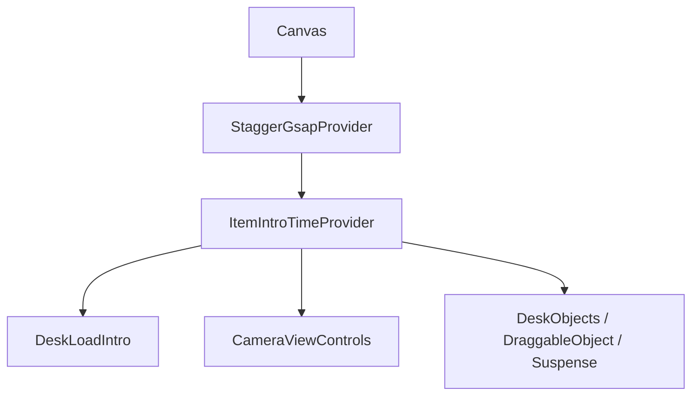
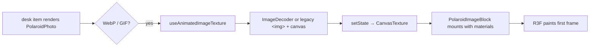

# Desk intro: layout JSON → Canvas → shared GSAP timeline

This document explains how the page-load **camera intro**, **staggered desk props**, and **animated WebP polaroids** are wired together, why **ordering** and **asynchronous** work create apparent “race conditions,” and what the code does to keep them in sync.

---

## 1. Where configuration lives

| Source | Role |
|--------|------|
| `src/data/desk-layout.json` | Shipped default: items, `camera`, `intro` (mode, `focusItemId`, `from`/`to`, `durationMs`, `staggerAfterCamera`, etc.) |
| `src/lib/desk-default-layout.ts` | Parses the JSON and exports `BUNDLED_DESK_INTRO`, `BUNDLED_STAGGER_AFTER`, `BUNDLED_ITEM_INTROS`, `BUNDLED_DESK_CAMERA`, … for use in components and `StaggerGsapContext`. |
| `src/lib/desk-layout.ts` | Type guards and merge helpers (e.g. `mergeDeskCameraWithDefaults`). |

The Canvas does **not** re-fetch these at runtime; it reads the **bundled** objects above (merged with any layout/storage logic elsewhere, e.g. `DeskLayoutContext` for dragged positions). For `zoomOutFromItem`, `DeskControlsProvider`’s **initial** `useState` seeds the ortho fields from `getZoomOutIntroStartCameraForInitialControls()` in `src/lib/desk-intro-bundled-start-camera.ts`, which uses the **same** focus X/Z as `getFocusItemLayoutForZoomOutIntroSync()` (bundled `desk-layout` or merged `localStorage` — same rules as `DeskLayoutContext.getItem`). That keeps the “zoomed on item” view aligned with the mesh so the **camera** does not pan horizontally when `useLayoutEffect` runs, and the first frame is not the wider **rest** default (`y ≈ 8`).

---

## 2. React tree (high level)

The orthographic `Canvas` in `src/components/desk/DeskScene.tsx` wraps the 3D scene. The **intro timeline** and **stagger** live under one provider so a **single** `gsap.timeline()` can be scrubbed in dev tools.



- **`StaggerGsapProvider`** — owns the **master** intro `gsap.timeline()`, registers `Object3D` targets per `layoutId`, debounces and runs **stagger** batches after the camera, exposes `isStaggerItemAnimated(id)` and related APIs.
- **`DeskLoadIntro`** — **only** the **camera** segment: reads intro config, lerp the ortho camera from “focused on item” to “rest” via the **shared** master timeline, then calls `setCameraAnimationComplete(true)` and adds the **`afterCamera`** label.
- **`ItemIntroGroup`** (per draggable item) — for non-**focus** items with `staggerAfterCamera`, applies `from` **position/scale/opacity** on the `THREE.Group` and registers the group with `StaggerGsapContext`.

---

## 3. The single GSAP master timeline

```mermaid
sequenceDiagram
  participant Page as Page / React
  participant DL as DeskLoadIntro
  participant Master as master gsap.timeline
  participant SG as StaggerGsapContext
  participant RPS as runPendingStagger (600ms debounce)

  Page->>DL: useLayout (intro + merged rest camera; focus from getItem)
  DL->>Master: getMasterIntroTimeline()
  DL->>Master: to(camera proxy) … onComplete: setCameraAnimationComplete(true)
  DL->>Master: addLabel("afterCamera", ">")

  Note over SG: cameraAnimationComplete becomes true
  SG->>RPS: setTimeout 600ms (see registry + debounce)
  RPS->>Master: add(subTl, "afterCamera" or ">") stagger props
```

**Key files**

- `src/components/desk/DeskLoadIntro.tsx` — appends the **camera** tween, sets `setIntroActive`, calls `setCameraAnimationComplete(true)` in `onComplete`, adds `afterCamera`. The intro **does not** wait for `DeskLayoutContext.loaded`: `getItem` already falls back to `BUNDLED_DESK_LAYOUT_ITEMS` while `state.items` is still empty, so the ortho camera can jump to the intro **start** on the first layout pass (avoids a brief default “rest” camera that read as a sudden scale change). The `useLayoutEffect` depends on a memoized **focus item position string** (`zoomFocusLayoutKey`), **not** on the `getItem` callback identity, so when `layout.loaded` flips and `getItem` is recreated, the effect does **not** re-run and cleanup does **not** call `resetMasterIntro()` in the middle of the camera tween.
- `src/context/StaggerGsapContext.tsx` — `getMasterIntroTimeline()`, `registerStaggerTarget`, `runPendingStagger` with GSAP `onUpdate` calling `setObject3DTreeOpacity` for `from.opacity` → `1`.

**Label order**

- First stagger batch: placed at `"afterCamera"` (if that label exists on the master), otherwise at `0`.
- Later batches (e.g. items that registered **late** after `Suspense`): placed at `">"` (sequentially after the previous stagger block).

---

## 4. Why a 600ms debounce after the camera

Registrations happen when each `ItemIntroGroup` **ref** fires. Polaroids and other content may mount **late** (e.g. `Suspense`, async image decode). Each new registration bumps `registryVersion` and, **when the camera is already complete**, the provider schedules `runPendingStagger` with a **600ms** debounce so **multiple** late mounts collapse into one batch instead of N tiny timelines. See the comment in `StaggerGsapContext.tsx` and the `useEffect` that depends on `cameraAnimationComplete` and `registryVersion`.

This is **not** a guarantee that every mesh exists yet; it only batches **stagger** scheduling in wall-clock time. Opacity and transforms for **already registered** `Object3D` roots are retried in the frame loop (below).

---

## 5. Per-item “hidden until camera, then stagger” (non-focus items)

For `layoutId !== focusItemId` with `BUNDLED_STAGGER_AFTER` set:

1. **`ItemIntroGroup` outer `group`** — R3F **props** set `from` position/scale on the first paint; the **ref** registers the group, applies `setObject3DTreeOpacity` when `from.opacity` is set, and calls `registerStaggerTarget(layoutId, group)`.
2. **`useFrame` (R3F)** — while **not** `isStaggerItemAnimated(layoutId)`, repeatedly calls `setObject3DTreeOpacity` on the same root so any **new** meshes (or materials) that appear under that group also get `from` opacity and correct shadow/depth flags (`src/lib/three-object-opacity.ts`).
3. **After** a stagger batch includes that `id`, `isStaggerItemAnimated` is true and the **per-item** `useFrame` opacity pass **stops**; GSAP’s `onUpdate` drives opacity until the intro completes.

`setObject3DTreeOpacity` not only sets `MeshStandardMaterial.opacity` but also toggles `castShadow`, `transparent`, and `depthWrite` in a way that avoids “gray shadow squares” at opacity 0.

---

## 6. Animated WebP polaroids: two extra async layers



1. **Texture readiness** — `useAnimatedImageTexture` (`src/components/desk/polaroid/useAnimatedImageTexture.ts`) resolves a **CanvasTexture** asynchronously (`fetch`, `ImageDecoder`, or `img.onload`). Until `texture` is non-null, `PolaroidWithCanvasImage` may render only the **frame** or `null` — the **print box** is missing.
2. **First paint of the print** — when the texture first becomes available, R3F creates the **print** `mesh` and materials. Their **default** `opacity` is **1** unless you pass something else on the **first** commit.

**Why a one-frame “flash” was possible (before the fix):**

- **React** `useLayoutEffect` and **ref** run in React’s commit order; **@react-three/fiber** attaches some objects in the same or the **next** engine tick. The first **drawn** frame can therefore show a new mesh with **default** materials.
- A **parent** can run `setObject3DTreeOpacity` **before** a **child** `mesh` exists in the `THREE` tree, so the traverse misses the print once; a later `useFrame` run fixes that **unless** the first rasterized frame already used opacity 1.

**Mitigations in this repo**

1. **`IntroStaggerFromOpacityContext`** — when `staggerAfterCamera.from.opacity` is set, `ItemIntroGroup` wraps its children in a provider with that value. **`PolaroidImageBlock`** (and the gradient print box) read `useIntroStaggerFromOpacity()` and set **initial** `opacity` / `transparent` / `depthWrite` on **all** six box materials to match the intro **on the first R3F props application**, avoiding a full-opacity first paint.
2. **`ItemIntroGroup`’s `useFrame`** (until stagger owns the id) — keeps **tree** opacity and **shadow/depth** rules in sync for **any** other meshes and for anything that might reset material state.

**Files:** `src/context/IntroStaggerFromOpacityContext.tsx`, `src/components/desk/ItemIntroGroup.tsx`, `src/components/desk/PolaroidPhoto.tsx`, `src/lib/three-object-opacity.ts`.

---

## 7. “Race conditions” in plain terms

| Phenomenon | What actually happens |
|------------|------------------------|
| Stagger runs before a polaroid exists | The **root** `Object3D` is registered; stagger animates that **group**. Opacity is applied to whatever **is** in the tree; new meshes are picked up by `useFrame` or GSAP `onUpdate` on subsequent frames. |
| 600ms delay feels random | It’s a **debounce** for **batching** new registrations after the camera, not a “wait for assets” promise. |
| `useLayoutEffect` vs R3F | Layout effects run in React’s order; the **WebGL** scene may not yet match the **last** commit on the **same** tick for every child. A **per-frame** pass is the reliable fix for **dynamic** Three.js children. |
| Positive `useFrame` priority in R3F | Subscribers are sorted by **increasing** `renderPriority` (lower = earlier). **Positive** priority also disables the default `gl.render` path in R3F unless you take over rendering, so the intro code uses **default** `0` and relies on **context** + `setObject3DTreeOpacity` instead. |

---

## 8. Quick reference: which system owns what

| Phase | Camera transform | Group transform + opacity (non-focus) | Timeline structure |
|-------|------------------|----------------------------------------|--------------------|
| During camera | GSAP tween on a **proxy** → `setCamera` in `DeskControls` | `ItemIntroGroup` `from` on `Group`; `useFrame` + context + `setObject3DTreeOpacity` | `DeskLoadIntro` segment + `afterCamera` label |
| After camera, before stagger | Rest position applied in `onComplete` | Still `from` values | `stagger` not yet in `animated` set |
| Stagger | — | GSAP tweens on `Group` position/scale; opacity via `onUpdate` → `setObject3DTreeOpacity` | `subTl` at `afterCamera` or `">"` |

---

## 9. Related dev tooling

- `src/lib/gsap-desk-animation-registry.ts` — registers the master timeline for dev bridges.
- `src/lib/gsap-devtools-flags.ts` / `GsapDevToolsBridge` — optional; master timeline is the one to scrub for **camera + stagger** end-to-end.

This should match the mental model: **one** timeline, **two** big phases (camera, then props), **debounced** stagger batches, and **per-frame** / **context** safety nets for **async** 3D and **async** image decode.
